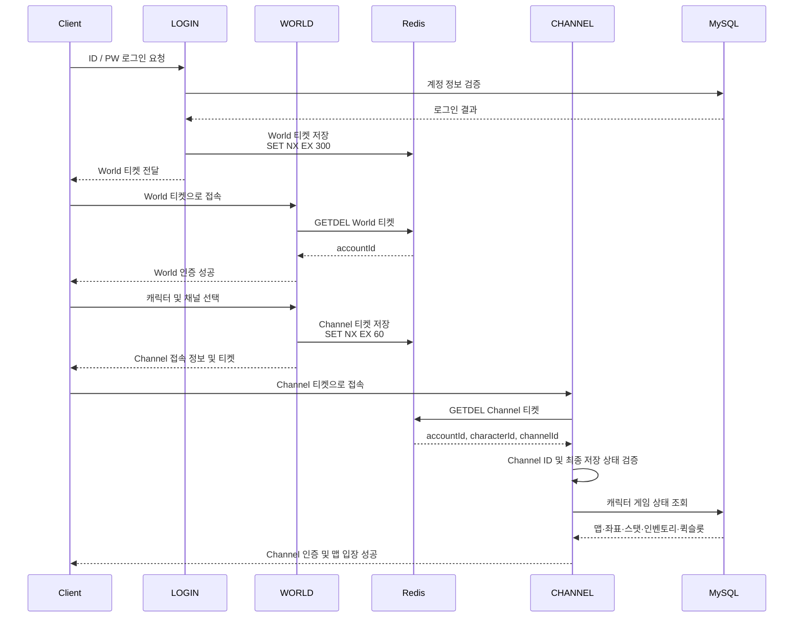
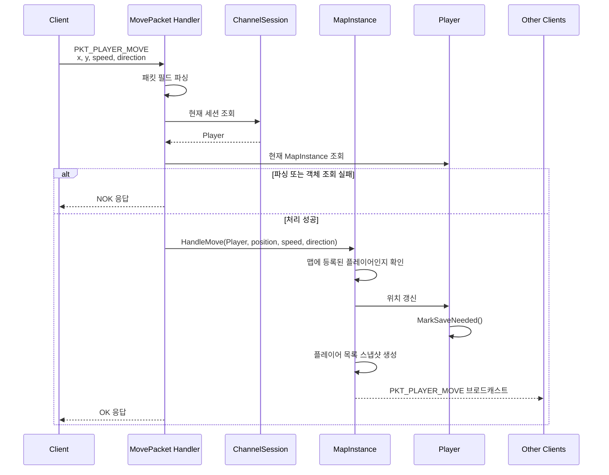
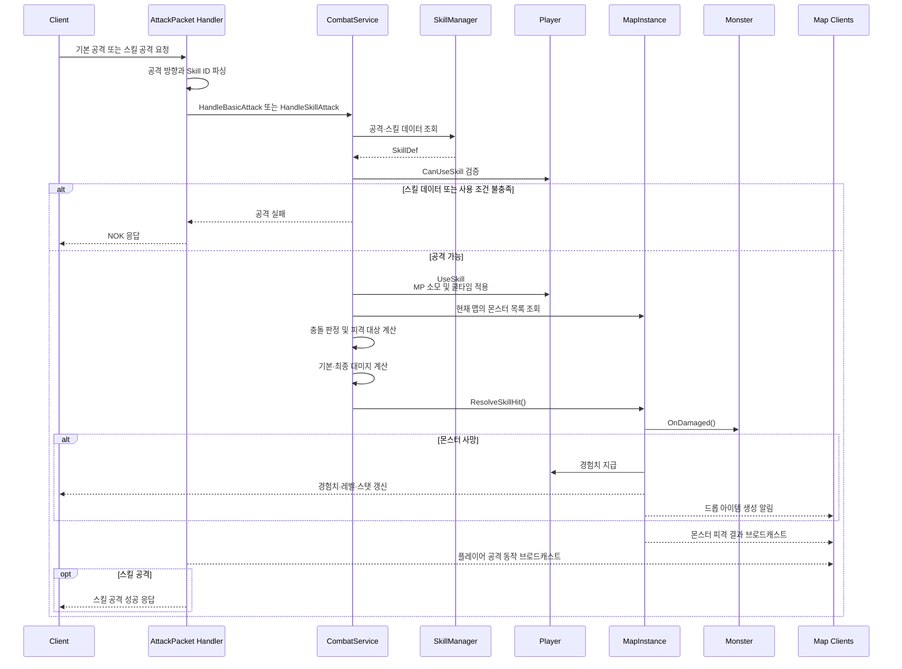
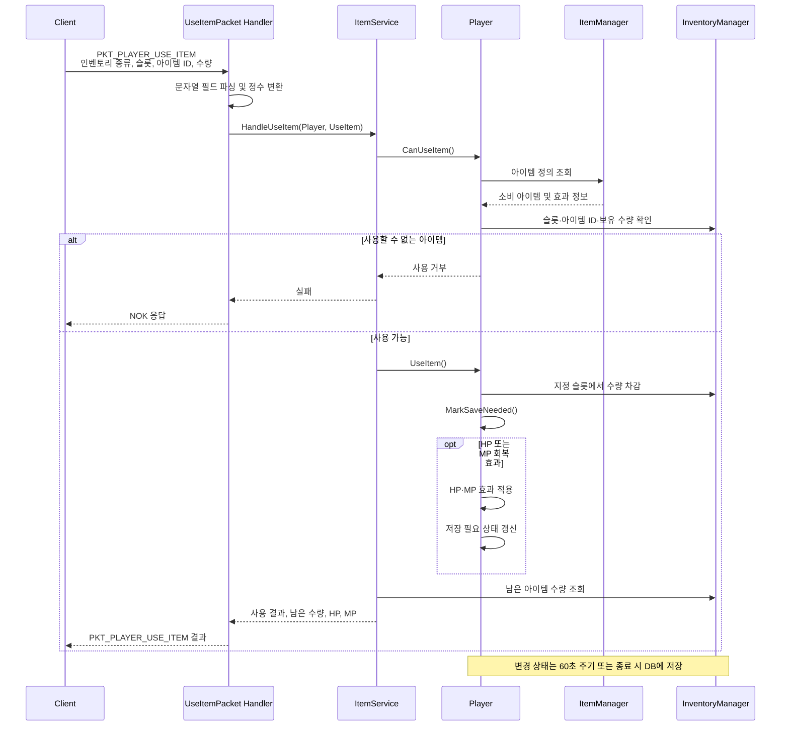

# LL2Games RPG Server

> C++17/Linux 기반 2D MMORPG 서버 프로젝트입니다.
> MAIN, LOGIN, WORLD, CHANNEL, CHAT으로 책임을 분리한 멀티 프로세스 구조이며,
> ChannelServer는 게임 플레이 트래픽, 채널 인증, 맵 입장, 이동·전투·아이템·교환 패킷 처리를 담당합니다.

[](LICENSE)
[](https://isocpp.org/)
[](https://www.linux.org/)

---

## 핵심 구현

- MAIN / LOGIN / WORLD / CHANNEL / CHAT으로 책임을 분리한 멀티 프로세스 구조
- ChannelServer의 epoll 기반 non-blocking TCP 처리
- TCP partial/coalesced packet 처리를 위한 세션 단위 수신 버퍼
- 4 KiB 수신 단위와 16 KiB 최대 패킷 크기 분리
- LOGIN -> WORLD -> CHANNEL 일회성 인증 티켓 적용
- Linux getrandom() 기반 256비트 난수 티켓 생성
- Redis SET NX EX 와 GETDEL을 이용한 충돌 방지·만료·재사용 차단
- fd, sessionId, generation을 이용한 비동기 인증 결과 검증
- 플레이어 상태 변경 감지 및 60초 주기 저장
- 연결 종료 시 전용 작업 풀을 이용한 비동기 최종 저장
- 캐릭터, 스탯, 인벤토리, 퀵슬롯을 하나의 MySQL 트랜잭션으로 저장
- 저장 버전을 이용해 저장 중 발생한 새로운 변경 상태 보존
- C++ 회귀·통합 테스트와 Python socket 기반 실제 네트워크 부하 테스트

## 검증 결과

### 자동 테스트

`make test`로 다음 항목을 검증했습니다.

| 영역 | 검증 항목 |
| --- | --- |
| 패킷 파서 | 최대·초과·최소 패킷, 부분 수신, 병합 수신 |
| 토큰 생성 | 64글자 소문자 16진수 형식, 10,000개 중복 없음 |
| 인증 티켓 | 최초 사용 성공, 재사용·만료·채널 불일치 거부 |
| 세션 회귀 | fd 재사용 후 오래된 인증 결과 거부 | 
| 저장 흐름 | 변경 감지, 저장 버전 비교, 실패 상태 유지 및 재시도 | 
| DB 트랜잭션 | 캐릭터·스탯·인벤토리·퀵슬롯 커밋 및 실패 시 롤백 |

### ChannelServer 부하 테스트 — 2026-08-06

측정 환경:

- 단일 ChannelServer
- localhost TCP 연결
- 동일 맵에 300개 클라이언트 배치
- 클라이언트당 초당 이동 패킷 1개
- 측정 시간 15초

| 항목 | 결과 |
|--- | --- |
| 인증 성공 | 300 / 300 |
| 맵 입장 성공 | 300 / 300 |
| 이동 패킷 전송 | 4,500 |
| 이동 브로드캐스트 수신 | 1,032,019 |
| 인증 평균 지연 | 약 3,004ms |
| 인증 p95 지연 | 약 5,453ms |
| ChannelServer 평균 CPU | 약 44.8% |
| ChannelServer 평균 RSS | 약 35.7MiB | 
| 부하 종료 후 신규 인증 | 약 208ms, 성공 |

본 결과는 localhost 기반 단일 서버 검증이며 운영 환경의 수용 인원을 의미하지 않습니다.

## 주요 안정성 개선 사례

| 영역 | 발견한 문제 | 개선 |
| --- | --- | --- |
| 패킷 처리 | 1KiB 제한과 TCP 수신 경계 처리 | 4 KiB 수신 단위, 16 KiB 최대 크기, 누적 파싱 및 경계 검증 |
| 서버 인증 | 서버 간 접속 권한 검증 부재 | LOGIN → WORLD → CHANNEL 일회성 Redis 티켓 |
| 상태 저장 | 종료 시 일부 스탯만 저장 | 60초 주기 및 종료 시 스냅샷·트랜잭션 기반 저장 |


## 📋 목차

- [프로젝트 개요](#-프로젝트-개요)
- [주요 기능](#-주요-기능)
- [아키텍처](#-아키텍처)
- [기술 스택](#-기술-스택)
- [프로젝트 구조](#-프로젝트-구조)
- [빌드 및 실행](#-빌드-및-실행)
- [시퀀스 다이어그램](#-시퀀스-다이어그램)
- [코드 구성 및 구현 기준](#-코드-구성-및-구현-기준)
- [문서](#-문서)
---

## 🎮 프로젝트 개요

LL2Games_RPG는 C++17로 작성된 Linux 기반 MMORPG 게임 서버입니다. 
시스템은 게임의 다양한 측면을 처리하는 전문화된 데몬 프로세스로 구성된 **멀티 서버 아키텍처**를 구현합니다.

### 서버 구성

| 서버 | 역할 |
|------|------|
| **MAIN** | 프로세스 관리자 및 모니터 - 모든 데몬 프로세스 관리 |
| **LOGIN** | 플레이어 인증 및 계정 관리 |
| **WORLD** | 캐릭터 선택, 채널 선택 및 월드 레벨 작업 |
| **CHANNEL** | 핵심 게임플레이 (맵, 플레이어, 몬스터, 전투, 스탯) |
| **CHAT** | 게임 내 채팅 및 커맨드 라우팅 |

### 핵심 특징

- **프로세스 간 통신(IPC)**: POSIX 메시지 큐를 통한 서버 간 통신
- **네트워킹**
  - **CHANNEL**: epoll 기반 non-blocking TCP 처리
  - **LOGIN / WORLD / CHAT**: select 기반 TCP 처리
- **멀티스레딩**: CHANNEL 인증·게임 패킷·주기 저장은 공용 작업 풀에서 처리하고, 연결 종료 시 최종 저장은 전용 저장 풀에서 처리
- **데이터 관리**
  - **MySQL**: 계정 및 캐릭터 게임 상태 영속화
  - **Redis**: 일회성 인증 티켓, 세션·채널 상태 및 캐시 관리

---

## ✨ 주요 기능

### 인증 및 계정 관리
- 사용자 로그인/로그아웃
- 계정 생성 및 관리
- 세션 관리 (Redis 기반)

### 캐릭터 시스템
- 캐릭터 생성/삭제
- 캐릭터 선택 및 채널 입장
- 스탯 시스템 (STR, DEX, INT, LUK)
- 레벨 및 경험치 관리

### 게임플레이
- 실시간 맵 시스템
- 플레이어 이동 및 위치 동기화
- 몬스터 AI 및 전투 시스템
- 데미지 계산 및 전투 로직

### 채팅 시스템
- 전체 채팅
- 귓속말
- 커맨드 패턴 기반 라우팅

---

## 🏗️ 아키텍처

### 시스템 아키텍처

```
┌─────────────────────────────────────────────────────────┐
│                      MAIN Server                        │
│              (Process Manager & Monitor)                │
└─────────────────────────────────────────────────────────┘
                            │
        ┌───────────────────┼───────────────────┐
        │                   │                   │
┌───────▼────────┐  ┌──────▼──────┐  ┌────────▼────────┐
│  LOGIN Server  │  │ WORLD Server │  │ CHANNEL Server  │
│  (Auth & Acc)  │  │ (Char Select)│  │  (Gameplay)     │
└────────────────┘  └──────────────┘  └─────────────────┘
        │                   │                   │
        └───────────────────┼───────────────────┘
                            │
                    ┌───────▼────────┐
                    │   CHAT Server  │
                    │   (Messaging)  │
                    └────────────────┘
                            │
        ┌───────────────────┴───────────────────┐
        │                                       │
┌───────▼────────┐                    ┌────────▼────────┐
│  MySQL Server  │                    │  Redis Server   │
│  (Persistent)  │                    │    (Cache)      │
└────────────────┘                    └─────────────────┘
```

### 디자인 패턴

- **Command 패턴**: 채팅 커맨드 및 IPC 작업
- **Factory 패턴**: 패킷 생성 (예: `ChannelPacketFactory`)
- **Repository 패턴**: 데이터베이스 접근 (예: `PlayerStatRepository`)
- **Service 패턴**: 비즈니스 로직 계층 (예: `StatService`, `MapService`)
- **Manager 패턴**: 리소스 관리 (예: `PlayerManager`, `MapManager`)
- **Connection Pool**: MySQL 및 Redis 커넥션 풀링

---

## 🛠️ 기술 스택

### 언어 및 표준
- **언어**: C++17
- **플랫폼**: Linux
- **컴파일러**: g++ with `-std=c++17 -O2 -Wall -Wextra -Werror`

### 빌드 시스템
- **빌드 도구**: GNU Make (재귀적 makefile)
- **컴파일러 플래그**: `-MMD -MP` (의존성 추적)
- **링커 플래그**: `-pthread` with rpath

### 네트워킹 및 IPC
- **네트워킹**
  - **CHANNEL**: epoll 기반 non-blocking TCP
  - **LOGIN / WORLD / CHAT**: select 기반 TCP
- **IPC**: POSIX 메시지 큐
- **스레딩**: pthread 기반 커스텀 스레드 풀

### 데이터베이스
- **주 DB**: MySQL (libmysqlclient)
  - 영구 저장소 (캐릭터, 계정, 스탯)
  - 커스텀 커넥션 풀 구현
- **캐시**: Redis (hiredis)
  - 일회성 인증 티켓 저장
  - 세션·채널 상태 및 캐시 관리

### 라이브러리
- **로깅**: 커스텀 slog 라이브러리 (libslog.so)
- **JSON**: nlohmann/json (헤더 온리 json.hpp)

---

## 📁 프로젝트 구조

### 디렉토리 구성

```
LL2Games_RPG/
├── SERVER/
│   ├── bin/          # 컴파일된 데몬 실행 파일 (mainD, loginD, chatD, worldD, channelD)
│   ├── build/        # 빌드 산출물
│   ├── docs/         # UML 다이어그램 및 아키텍처 문서
│   ├── include/      # 서버 공용 헤더
│   │   └── COMMON/   # 공용 타입, 패킷, DB, IPC, 스레드, 설정, 로깅, 유틸
│   ├── src/          # 서버별 소스 및 서버 전용 헤더
│   │   ├── COMMON/   # 공용 라이브러리 구현
│   │   ├── MAIN/     # 프로세스 관리자 및 데몬 모니터
│   │   ├── LOGIN/    # 인증 및 계정 서버
│   │   ├── CHAT/     # 채팅 및 커맨드 라우팅 서버
│   │   ├── WORLD/    # 캐릭터 선택, 채널 선택, 월드 레벨 서버
│   │   └── CHANNEL/  # 핵심 게임플레이 서버
│   ├── obj/          # 컴파일된 오브젝트 파일 (src 구조 미러링)
│   ├── lib/          # 정적 및 공유 라이브러리
│   │   ├── common/   # 공통 라이브러리
│   │   ├── mysql/    # MySQL 라이브러리
│   │   └── slog/     # 로깅 라이브러리
│   └── logs/         # 데몬별로 구성된 런타임 로그
└── Test/         # 테스트 유틸리티 및 IPC 테스트 프로그램
    ├── cpp/
    ├── python/
    └── results/         
```

### 서버 모듈 구조

각 서버 데몬은 역할에 따라 다음 모듈 이름을 사용합니다:

```
SERVER/src/{SERVER_TYPE}/
├── app/          # 서버 생명주기, 세션, 서버 전용 애플리케이션 서비스
├── db/           # 데이터베이스 접근 계층 (MySQL, Redis)
├── packet/       # 패킷 핸들러, 팩토리, 직렬화
├── command/      # 커맨드 패턴 구현 (CHAT)
├── daemon/       # 데몬 프로세스 추상화 및 생성 (MAIN)
├── manager/      # 프로세스/리소스 관리자 (MAIN, CHANNEL)
├── monitor/      # 프로세스 상태 감시 (MAIN)
├── util/         # 서버별 유틸리티
├── Makefile      # 서버별 빌드 스크립트
└── main.cpp      # 데몬 진입점
```

```
SERVER/src/CHANNEL/
├── app/          # ChannelServer, ChannelSession, 네트워크 세션
├── domain/       # 순수 게임 객체: Player, Monster, Item, Inventory, Projectile
├── manager/      # 런타임 리소스/캐시 관리: PlayerManager, ItemManager 등
├── service/      # 비즈니스 유스케이스: MapService, ItemService, CombatService 등
├── map/          # 맵 인스턴스, 맵 관리자, 맵 업데이트 태스크
├── db/           # MySQL/Redis/Repository/DB 기반 Service
├── packet/       # 패킷 핸들러/팩토리/송신기
├── ipc/          # 서버 간 메시지 큐
├── stat/         # 스탯 전용 도메인/서비스/저장소
├── util/         # 수학, 시간, 파싱 등 범용 유틸
├── data/         # 아이템, 몬스터, 맵, 스킬, 드롭 JSON 데이터
├── Makefile      # CHANNEL 서버 빌드 스크립트
└── main.cpp      # CHANNEL 데몬 진입점
```

```
SERVER/src/MAIN/
├── daemon/       # BaseDaemon 및 서버별 Daemon 구현
├── manager/      # ProcessManager
├── monitor/      # ProcessMonitor
├── Makefile
└── main.cpp
```

```
SERVER/src/LOGIN/
├── app/          # Server, Client
├── db/           # MySQLManager
├── packet/       # LoginHandler, LoginPacketFactory
├── util/         # StringUtil
├── Makefile
└── main.cpp
```

```
SERVER/src/CHAT/
├── app/          # Server, Client
├── command/      # CommandDispatcher, FindUserCommand
├── db/           # MySQLManager
├── packet/       # ChatInitHandler, ChatMsgHandler, ChatPacketFactory
├── util/         # StringUtil
├── Makefile
└── main.cpp
```

```
SERVER/src/WORLD/
├── app/          # WorldServer, WorldSession, ChannelManager, CharacterService
├── db/           # MySQL/Redis 클라이언트
├── packet/       # 월드 초기화, 캐릭터, 채널 선택 패킷 처리
├── Makefile
└── main.cpp
```

---

## 🚀 빌드 및 실행

### 사전 요구사항

```bash
# 필수 패키지 설치
sudo apt-get update
sudo apt-get install -y \
    build-essential \
    g++ \
    make \
    libmysqlclient-dev \
    libhiredis-dev \
    nlohmann-json3-dev
```

### 빌드

```bash
# 전체 빌드
cd SERVER
make

# 특정 서버 빌드
make login    # LOGIN 서버 빌드
make chat     # CHAT 서버 빌드
make world    # WORLD 서버 빌드
make channel  # CHANNEL 서버 빌드
make main     # MAIN 서버 빌드

# 공통 라이브러리만 빌드
make common

# 빌드 산출물 정리
make clean    # 오브젝트 파일 제거
make fclean   # 오브젝트 및 바이너리 제거
make re       # 전체 재빌드 (fclean + all)
```

### 실행

```bash
# 서버 실행 (bin 디렉토리에서)
cd SERVER/bin

# MAIN 서버 먼저 실행 (프로세스 관리자)
./mainD --config <config-file-path>
# 서버 실행에는 환경별 설정 파일이 필요합니다. 설정 파일에는 서버 포트, MySQL 및 Redis 연결 정보 등이 포함됩니다.

# 개별 서버 실행
./loginD
./worldD
./channelD
./chatD
```

### 출력 구조

- **바이너리**: `SERVER/bin/` - 컴파일된 데몬 실행 파일
- **라이브러리**: `SERVER/lib/` - 정적 및 공유 라이브러리
- **오브젝트**: `SERVER/obj/` - 컴파일된 오브젝트 파일
- **로그**: `SERVER/logs/` - 데몬 타입별로 구성된 서버 로그

---

## 📊 시퀀스 다이어그램

### 일회성 인증 티켓 기반 서버 입장



### 플레이어 이동 플로우

플레이어 이동 및 위치 동기화:



### 전투(공격) 플로우



### 아이템 사용 플로우

플레이어 아이템 사용 :



---

## 📝 코드 구성 및 구현 기준

- 클래스와 메서드는 UpperCamelCase를 기본으로 사용
- 멤버 변수는 `m_` 접두사를 사용
- 신규 상수는 `kMaxPacketSize`와 같은 `kUpperCamelCase` 형식을 사용
- 주요 시스템 콜과 DB 작업의 실패 결과를 로그로 기록
- MySQL 및 Redis 커넥션 풀 사용
- DB·Redis 연결의 획득과 반환에 RAII 가드 적용
- pthread 기반 커스텀 작업 풀 사용
- 연결 종료 시 최종 저장 작업은 전용 저장 풀에서 처리
- slog를 이용해 세션, 플레이어 ID 및 실패 원인을 기록

기존 코드에는 핸들러 내부 처리, 원시 포인터 및 이전 명명 방식이 일부 남아 있으며 점진적으로 개선하고 있습니다.

---

## 📄 문서
- [서버 안정성 개선 상세](SERVER/docs/Improvements/server_stability_improvements_2026-08.md)
- [ChannelServer 통합·부하 테스트 결과](SERVER/docs/Tests/channel_server_validation_2026-08-06.md)
- [채널 서버 성능/수신 경계 테스트 기준 측정](SERVER/docs/Tests/channel_server_performance_baseline_2026-06-30.md)
- [패킷 프로토콜 명세서](https://bottlenose-error-361.notion.site/LL2Games_PRG-3a7c0b1b991d803199c1cec7e7c7de70)
- [데이터베이스 설계 및 데이터 흐름](https://bottlenose-error-361.notion.site/LL2Games_RPG-3a7c0b1b991d809f8e11cb7901c26e86)
---

## 📄 라이선스

이 프로젝트는 MIT 라이선스 하에 배포됩니다. 자세한 내용은 [LICENSE](LICENSE) 파일을 참조하세요.

---

## 👥 기여

이 프로젝트는 포트폴리오 목적으로 개발되었습니다.

---

## 📞 연락처

프로젝트에 대한 문의사항이 있으시면 이슈를 등록해주세요.

---

<div align="center">

**LL2Games RPG Server** - C++17/Linux 기반 MMORPG 게임 서버

Made with ❤️ using C++17

</div>
